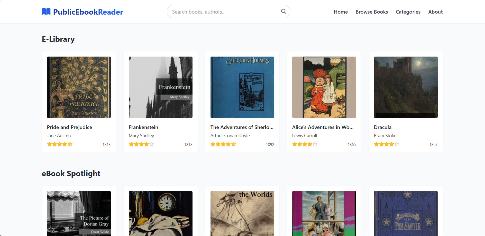
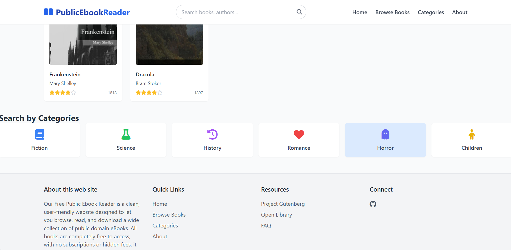

# PublicEbookReader

## Over View

A web application to search, browse, download, and read public domain eBooks. Built using HTML, Tailwind CSS, JavaScript, Git, GitHub, Jenkins and Zoho Catalyst. Web site link : [text](http://publicebookreader-60043800614.development.catalystserverless.in/app/BookUi.html)

## Technology Stack

<b>Front-End : </b>🌐 HTML5, 🎨 Tailwind CSS / Custom CSS, ⚙️ JavaScript

<b>Resources & Tools : </b>🛠️ Git and GitHub, 🌐 Zoho Catalyst Web Hosting, 🧑‍💻 Jenkins Pipeline for automate testing

<b>Back-End : </b>🧑‍💻 Pure Front-End Project: No dedicated server or database.📁 Simulated Backend: Book data is hardcoded in JavaScript as an array of objects

### ScreenShots

<b>User Interface</b>

<b>Book View</b>

<b>Search Bar</b>

<b>Categories</b>
